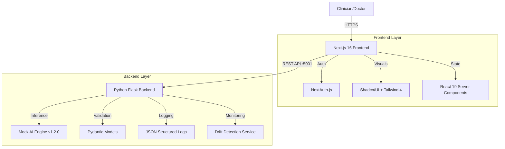
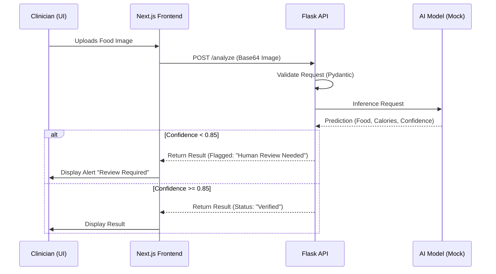
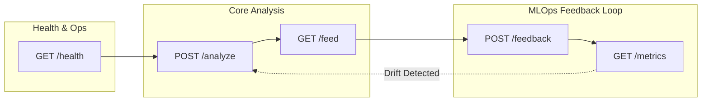
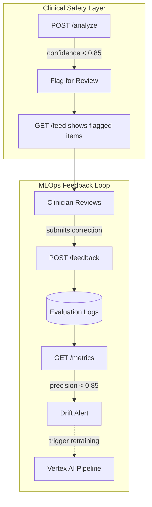

# 🥗 NutriGuard Clinical Ops

[](https://nextjs.org/)
[](https://react.dev/)
[](https://tailwindcss.com/)
[](https://flask.palletsprojects.com/)
[](./LICENSE)

**NutriGuard** is a next-generation clinical food analysis and monitoring system designed for healthcare environments. It leverages AI-powered computer vision (simulated) to track patient nutrition intake in real-time, providing clinicians with immediate feedback and drift detection metrics for model performance.

---

## 🏗 System Architecture

NutriGuard operates on a decoupled client-server architecture, utilizing a high-performance Next.js 16 frontend and a robust Python Flask backend.



### 🔄 Data Flow: Food Analysis

The core workflow involves a clinician reviewing a food item, which is then sent to the backend for analysis.



---

## 🛠 Technology Stack

### **Frontend (Client)**
*   **Core**: [Next.js 16.1](https://nextjs.org/) (App Router, Server Actions)
*   **UI Library**: [React 19.2](https://react.dev/)
*   **Styling**: [Tailwind CSS v4](https://tailwindcss.com/)
*   **Components**: [Shadcn/UI](https://ui.shadcn.com/) (Radix Primitives)
*   **Animation**: Framer Motion
*   **Visualization**: Recharts
*   **Icons**: Lucide React

### **Backend (Server)**
*   **Framework**: Flask (Python)
*   **Validation**: Pydantic v2
*   **Server**: Gunicorn (Production) / Werkzeug (Dev)
*   **CORS**: Flask-CORS

---

## 🚀 Getting Started

### Prerequisites
*   **Node.js**: v20+ (Required for Next.js 16)
*   **Python**: v3.10+
*   **npm** or **pnpm**

### 1. Backend Setup (Port 5001)

The backend is configured to run on port `5001` to avoid conflicts with AirPlay or other MacOS services often found on port 5000.

```bash
# From the root directory
./start-backend.sh
```
*This script automatically handles virtual environment creation (`.venv`), dependency installation `pip install -r requirements.txt`, and server startup.*

### 2. Frontend Setup (Port 3000)

```bash
# Open a new terminal tab
cd frontend

# Install dependencies
npm install

# Run the development server
npm run dev
```

Visit **[http://localhost:3000](http://localhost:3000)** to view the application.

---

## ⚡️ Key Features

*   **Live Clinical Feed**: Real-time websocket-like simulation of patient intake scans.
*   **AI Confidence Scoring**: Automatic flagging system. If the AI confidence score is below 85%, the system flags the entry for manual clinician review.
*   **Drift Detection**: The `/metrics` endpoint monitors model performance over time, detecting "concept drift" if precision drops below the safety threshold.
*   **Modern UI/UX**: Built with the latest React 19 capabilities and Tailwind 4 for a responsive, accessible, and "Dark Clinical Luxury" aesthetic.

---

## 📡 API Reference

The backend exposes a RESTful API designed around clinical MLOps principles. Each endpoint serves a specific role in the food analysis and model monitoring pipeline.

### Endpoint Overview



---

### `GET /health`

**Purpose**: Kubernetes liveness/readiness probe for container orchestration.

**Why it exists**: In a production GKE environment, the kubelet uses this endpoint to determine if the pod is healthy and ready to receive traffic. If this endpoint fails, Kubernetes will automatically restart the container.

| Field | Value |
|-------|-------|
| URL | `/health` |
| Method | `GET` |
| Auth | None |

**Response** `200 OK`
```json
{
  "status": "healthy",
  "model_version": "nutriguard-v1.2.0"
}
```

---

### `POST /analyze`

**Purpose**: Core AI inference endpoint for food recognition.

**Why it exists**: This is the primary business logic endpoint. Clinicians upload food images (or descriptions), and the AI model identifies the food item, estimates calories, and returns a confidence score. The `requires_human_review` flag implements our **safety-first paradigm** — any prediction below 85% confidence is automatically flagged for manual review by medical staff.

| Field | Value |
|-------|-------|
| URL | `/analyze` |
| Method | `POST` |
| Content-Type | `application/json` |
| Auth | None (would be JWT in production) |

**Request Body**
```json
{
  "image_base64": "data:image/jpeg;base64,/9j/4AAQ...",  // Optional
  "food_description": "Grilled salmon with vegetables"   // Optional
}
```

**Response** `200 OK`
```json
{
  "food_name": "Salmon Fillet",
  "calories": 280,
  "confidence_score": 0.9234,
  "model_version": "nutriguard-v1.2.0",
  "requires_human_review": false
}
```

**Response** `200 OK` (Flagged for Review)
```json
{
  "food_name": "Unknown Mixed Bowl",
  "calories": 340,
  "confidence_score": 0.7821,
  "model_version": "nutriguard-v1.2.0",
  "requires_human_review": true
}
```

**Error Responses**

| Code | Description |
|------|-------------|
| `422` | Validation error (Pydantic) |
| `500` | Internal server error |

---

### `GET /feed`

**Purpose**: Real-time patient intake feed for the clinician dashboard.

**Why it exists**: Clinical environments require real-time visibility into patient nutrition data. This endpoint simulates a "live feed" of recent scans, similar to what you'd see in an ICU monitoring dashboard. Each scan includes:
- Patient identifier (anonymized)
- Food item detected
- Confidence score and status
- Relative timestamp ("2 mins ago")

This allows clinicians to quickly identify flagged items that need manual review.

| Field | Value |
|-------|-------|
| URL | `/feed` |
| Method | `GET` |
| Auth | None |

**Response** `200 OK`
```json
{
  "scans": [
    {
      "id": "scan-1",
      "patient_id": "PT-8821",
      "food": "Sockeye Salmon",
      "confidence": 0.991,
      "timestamp": "Just now",
      "status": "verified",
      "requires_review": false
    },
    {
      "id": "scan-2",
      "patient_id": "PT-9932",
      "food": "Unknown Mixed Bowl",
      "confidence": 0.724,
      "timestamp": "2 mins ago",
      "status": "flagged",
      "requires_review": true
    }
  ],
  "total": 6,
  "flagged_count": 2,
  "model_version": "nutriguard-v1.2.0"
}
```

---

### `POST /feedback`

**Purpose**: Clinician feedback submission for model evaluation.

**Why it exists**: This endpoint is the cornerstone of our **MLOps feedback loop**. When a clinician reviews a flagged prediction, they submit whether the AI was correct or not, along with the ground-truth food item. This data is stored and used to:
1. Calculate real-time model precision
2. Detect concept drift (model degradation over time)
3. Build a labeled dataset for model retraining

Without this endpoint, we have no way to know if our model is performing well in production.

| Field | Value |
|-------|-------|
| URL | `/feedback` |
| Method | `POST` |
| Content-Type | `application/json` |
| Auth | None |

**Request Body**
```json
{
  "scan_id": "scan-2",
  "is_correct": false,
  "actual_food": "Quinoa Salad with Chicken"
}
```

**Response** `201 Created`
```json
{
  "status": "success",
  "message": "Feedback recorded successfully",
  "total_feedback_count": 42
}
```

**Error Responses**

| Code | Description |
|------|-------------|
| `400` | Missing required field |
| `500` | Internal server error |

---

### `GET /metrics`

**Purpose**: Real-time model performance monitoring and drift detection.

**Why it exists**: In MLOps, models degrade over time due to "concept drift" — the real-world data distribution changes, but the model stays static. This endpoint calculates:

- **Precision**: `correct_predictions / total_feedback`
- **Drift Status**: If precision drops below 85%, we flag "Drift Detected"

This allows the ML team to proactively retrain the model before it causes patient safety issues. In a full implementation, this would trigger alerts via PagerDuty/Slack.

| Field | Value |
|-------|-------|
| URL | `/metrics` |
| Method | `GET` |
| Auth | None |

**Response** `200 OK` (Healthy)
```json
{
  "precision": 0.92,
  "sample_size": 150,
  "drift_status": "Stable",
  "model_version": "nutriguard-v1.2.0",
  "drift_threshold": 0.85
}
```

**Response** `200 OK` (Drift Detected)
```json
{
  "precision": 0.78,
  "sample_size": 200,
  "drift_status": "Drift Detected",
  "model_version": "nutriguard-v1.2.0",
  "drift_threshold": 0.85
}
```

---

### API Design Philosophy



**Key Design Decisions**:

1. **85% Confidence Threshold**: Industry standard for medical AI. Below this, human oversight is required.
2. **Stateless API**: Each request is independent. No sessions. Scales horizontally.
3. **Pydantic Validation**: All request/response models are validated at runtime, catching errors before they hit business logic.
4. **Structured Logging**: Every request logs `patient_id`, `confidence`, `status` for audit trails.
5. **CORS Enabled**: Frontend and backend can run on different origins during development.

---

## 🛡 Production Deployment

### Docker Support
The project includes `Dockerfile` configurations for both services.

**Backend Build:**
```bash
cd backend
docker build -t nutriguard-backend .
docker run -p 5001:5001 nutriguard-backend
```

**Frontend Build:**
```bash
cd frontend
docker build -t nutriguard-frontend .
docker run -p 3000:3000 nutriguard-frontend
```

### Environment Variables
Ensure you populate `.env.local` in the frontend directory for production:
```bash
NEXT_PUBLIC_API_URL=https://api.your-domain.com
NEXTAUTH_SECRET=your-secret-key
GOOGLE_CLIENT_ID=...
```

---

## 🤝 Contributing

1.  Fork the repository
2.  Create your feature branch (`git checkout -b feature/AmazingFeature`)
3.  Commit your changes (`git commit -m 'Add some AmazingFeature'`)
4.  Push to the branch (`git push origin feature/AmazingFeature`)
5.  Open a Pull Request
