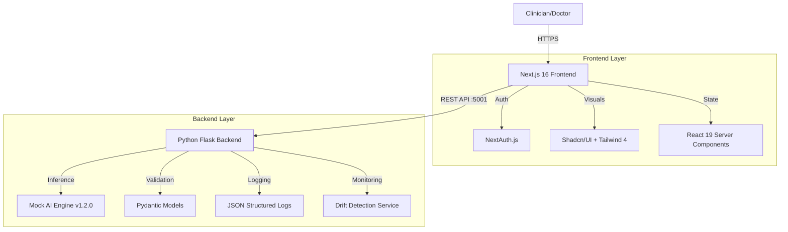
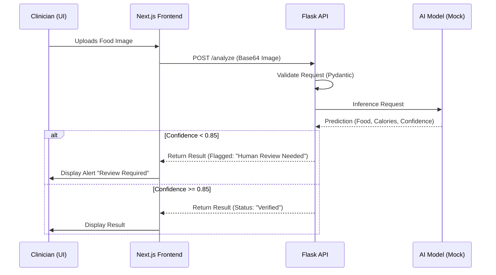

# 🥗 NutriGuard Clinical Ops

[](https://nextjs.org/)
[](https://react.dev/)
[](https://tailwindcss.com/)
[](https://flask.palletsprojects.com/)
[](./LICENSE)

**NutriGuard** is a next-generation clinical food analysis and monitoring system designed for healthcare environments. It leverages AI-powered computer vision (simulated) to track patient nutrition intake in real-time, providing clinicians with immediate feedback and drift detection metrics for model performance.

---

## 🏗 System Architecture

NutriGuard operates on a decoupled client-server architecture, utilizing a high-performance Next.js 16 frontend and a robust Python Flask backend.



### 🔄 Data Flow: Food Analysis

The core workflow involves a clinician reviewing a food item, which is then sent to the backend for analysis.



---

## 🛠 Technology Stack

### **Frontend (Client)**
*   **Core**: [Next.js 16.1](https://nextjs.org/) (App Router, Server Actions)
*   **UI Library**: [React 19.2](https://react.dev/)
*   **Styling**: [Tailwind CSS v4](https://tailwindcss.com/)
*   **Components**: [Shadcn/UI](https://ui.shadcn.com/) (Radix Primitives)
*   **Animation**: Framer Motion
*   **Visualization**: Recharts
*   **Icons**: Lucide React

### **Backend (Server)**
*   **Framework**: Flask (Python)
*   **Validation**: Pydantic v2
*   **Server**: Gunicorn (Production) / Werkzeug (Dev)
*   **CORS**: Flask-CORS

---

## 🚀 Getting Started

### Prerequisites
*   **Node.js**: v20+ (Required for Next.js 16)
*   **Python**: v3.10+
*   **npm** or **pnpm**

### 1. Backend Setup (Port 5001)

The backend is configured to run on port `5001` to avoid conflicts with AirPlay or other MacOS services often found on port 5000.

```bash
# From the root directory
./start-backend.sh
```
*This script automatically handles virtual environment creation (`.venv`), dependency installation `pip install -r requirements.txt`, and server startup.*

### 2. Frontend Setup (Port 3000)

```bash
# Open a new terminal tab
cd frontend

# Install dependencies
npm install

# Run the development server
npm run dev
```

Visit **[http://localhost:3000](http://localhost:3000)** to view the application.

---

## ⚡️ Key Features

*   **Live Clinical Feed**: Real-time websocket-like simulation of patient intake scans.
*   **AI Confidence Scoring**: Automatic flagging system. If the AI confidence score is below 85%, the system flags the entry for manual clinician review.
*   **Drift Detection**: The `/metrics` endpoint monitors model performance over time, detecting "concept drift" if precision drops below the safety threshold.
*   **Modern UI/UX**: Built with the latest React 19 capabilities and Tailwind 4 for a responsive, accessible, and "Dark Clinical Luxury" aesthetic.

---

## 🛡 Production Deployment

### Docker Support
The project includes `Dockerfile` configurations for both services.

**Backend Build:**
```bash
cd backend
docker build -t nutriguard-backend .
docker run -p 5001:5001 nutriguard-backend
```

**Frontend Build:**
```bash
cd frontend
docker build -t nutriguard-frontend .
docker run -p 3000:3000 nutriguard-frontend
```

### Environment Variables
Ensure you populate `.env.local` in the frontend directory for production:
```bash
NEXT_PUBLIC_API_URL=https://api.your-domain.com
NEXTAUTH_SECRET=your-secret-key
GOOGLE_CLIENT_ID=...
```

---

## 🤝 Contributing

1.  Fork the repository
2.  Create your feature branch (`git checkout -b feature/AmazingFeature`)
3.  Commit your changes (`git commit -m 'Add some AmazingFeature'`)
4.  Push to the branch (`git push origin feature/AmazingFeature`)
5.  Open a Pull Request
